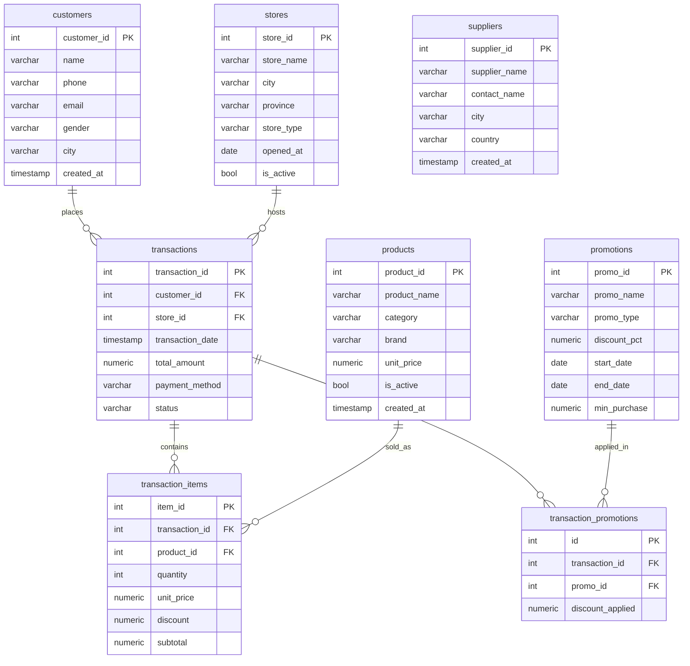
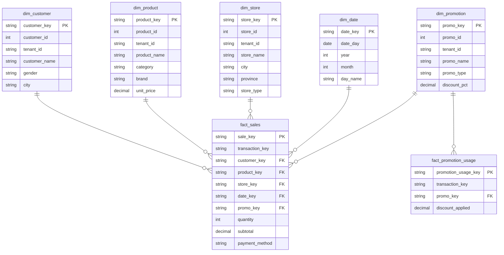
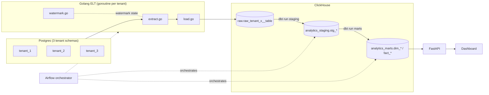

# ERD — Parkee POS

## OLTP (source, per tenant schema)

`suppliers` has no FK into `fact_sales` at Intermediate level — it's staged (`stg_suppliers`) but only becomes relevant via `product_supplier` at Advanced level.

Note: `customer_id`, `product_id`, etc. are `SERIAL` per tenant schema, so raw values collide across tenants (e.g. `tenant_1.customer_id = 1` and `tenant_2.customer_id = 1` are different people). Surrogate keys in the star schema are `tenant_id || '-' || id`.

## Star Schema (marts, ClickHouse)

## Pipeline architecture

